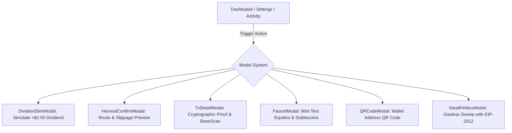

# Alloy — Complete Decentralized Application Architecture & Implementation Plan (`DAPP-PLAN.md`)

## 1. Executive Summary & Product Vision

**Alloy** is the premier private, programmable dividend and payout rail for tokenized equities on **Base**. While Coinbase and Backed B20 tokenized assets (e.g., $AAPLc$, $NVDAc$, $COINc$) accrue real cash dividends onchain via increasing mathematical multipliers, these yields currently remain locked inside the asset or expose recipient identities permanently to public chain explorers upon distribution.

Alloy solves this on Base through three pillars:
1. **Mathematical Surplus Extraction**: Non-custodially harvests accumulated dividend yield while preserving 100% of underlying equity principal shares.
2. **Unlinkable Payouts via Basenames**: Directs extracted yield to Base native `.base.eth` names, which automatically resolve to ERC-5564 stealth meta-addresses without linking the sender and recipient onchain.
3. **Multi-Currency Routing & Composability**: Instantly converts equity dividends into emerging market stablecoins ($cNGN$, $USDC$) or Base-native meme tokens ($CLANKER$, $HIGHER$, $DEGEN$).

This document provides the complete, production-ready blueprint for the Next.js front-end application located in `app/`. It outlines a clean, uncluttered, high-end fintech user experience optimized for both desktop viewports and mobile Progressive Web App (PWA) installations.

---

## 2. Information Architecture & Routing

The application utilizes the Next.js App Router structure with client-side state preservation and smooth transitions.

```
app/
├── public/
│   ├── manifest.json                 # PWA Web App Manifest
│   ├── icons/                        # PWA Icons (192x192, 512x512, apple-touch-icon)
│   └── favicon.ico
├── app/
│   ├── layout.tsx                    # Root Layout (Fonts, Metadata, PWA tags, Theme Script)
│   ├── providers.tsx                 # Wagmi, QueryClient, ProfileProvider, ModalProvider
│   ├── globals.css                   # Tailwind v4 theme, safe-area utilities, glassmorphism
│   ├── page.tsx                      # Public Landing Page
│   ├── login/
│   │   └── page.tsx                  # Connect Wallet & Profile Onboarding
│   ├── (dashboard)/                  # Authenticated App Shell (Sidebar + Mobile Floating Nav)
│   │   ├── layout.tsx                # App Shell Layout (Desktop Sidebar, Mobile Bottom Bar)
│   │   ├── dashboard/
│   │   │   └── page.tsx              # Dashboard (Portfolio, Accrued Dividends, Harvest Studio)
│   │   ├── analytics/
│   │   │   └── page.tsx              # Analytics (1D / 7D / 30D Dividend Progression & Charts)
│   │   ├── activity/
│   │   │   └── page.tsx              # Activity Ledger (Tx History, Status, Filter Tabs)
│   │   └── settings/
│   │       └── page.tsx              # Settings (Profile, Token Balances, Stealth Manager, Logout)
├── components/
│   ├── layout/
│   │   ├── Sidebar.tsx               # Collapsible Desktop Sidebar (≥ 1024px)
│   │   ├── MobileBottomNav.tsx       # Floating Mobile Navigation Bar (< 1024px)
│   │   ├── Header.tsx                # Top Bar (Network Badge, Live Faucet Pill, Profile Avatar)
│   │   └── PWAInstallPrompt.tsx      # Non-intrusive mobile install prompt banner
│   ├── landing/
│   │   ├── HeroSection.tsx           # Value proposition, CTA, animated glow
│   │   ├── LiveTicker.tsx            # Live Base Sepolia stock multipliers & spot prices
│   │   ├── FeatureGrid.tsx           # 3 core pillars (Surplus Extraction, Stealth, Composability)
│   │   └── PrivacyVisualizer.tsx     # Interactive flow diagram (Sender -> Stealth -> Recipient)
│   ├── dashboard/
│   │   ├── PortfolioSummary.tsx      # Total Equity Value, Accrued Yield, 30D APY
│   │   ├── StockHoldingCard.tsx      # Individual stock card (AAPLc, NVDAc, COINc)
│   │   ├── HarvestStudio.tsx         # Asset selection, currency choice, recipient input
│   │   └── QuickFaucetBar.tsx        # 1-Click mock share minter for hackathon testing
│   ├── analytics/
│   │   ├── TimeframeSelector.tsx     # 1D / 7D / 30D selector pills
│   │   ├── DividendProgressionChart.tsx # SVG/Canvas responsive cumulative yield chart
│   │   ├── MultiplierGrowthChart.tsx # Step-function multiplier expansion tracker
│   │   ├── CurrencyDistribution.tsx  # Breakdown by payout asset (USDC vs Meme vs cNGN)
│   │   └── TradFiComparisonCard.tsx  # Speed & withholding tax comparison metrics
│   ├── activity/
│   │   ├── ActivityTable.tsx         # Filterable event list (Harvest, Swap, Stealth, Sweep)
│   │   └── ActivityRow.tsx           # Individual item with status badge and copy button
│   ├── settings/
│   │   ├── ProfileEditor.tsx         # Username, background color theme, emoji avatar picker
│   │   ├── TokenBalancesTable.tsx    # Balances for all 9 deployed tokens + Base ETH
│   │   ├── StealthManager.tsx        # User stealth meta-address, ERC-6538 registration status
│   │   └── StealthInboxModal.tsx     # Scan incoming announcements & 1-click gasless sweep
│   ├── modals/                       # Popup system keeping main screens uncluttered
│   │   ├── DividendSimModal.tsx      # Simulate +$2.50 dividend onchain to trigger multiplier jump
│   │   ├── HarvestConfirmModal.tsx   # Detailed breakdown, slippage, gas estimate, execute
│   │   ├── TxDetailModal.tsx         # Rich transaction receipt with BaseScan Sepolia links
│   │   ├── FaucetModal.tsx           # Mint test AAPLc, NVDAc, COINc, USDC, etc.
│   │   └── QRCodeModal.tsx           # Receive address QR code popup
│   └── ui/                           # Reusable design primitives
│       ├── Button.tsx
│       ├── Card.tsx
│       ├── Modal.tsx
│       ├── Badge.tsx
│       ├── Input.tsx
│       └── Dropdown.tsx
├── lib/
│   ├── contracts/
│   │   ├── addresses.ts              # Base Sepolia deployed contract addresses
│   │   └── abis.ts                   # Minimal human-readable/JSON ABIs for all contracts
│   ├── hooks/
│   │   ├── useAlloyStocks.ts         # Multiplier, balances, and accrued surplus calculation
│   │   ├── useHarvest.ts             # Encode & submit harvest transactions
│   │   ├── useBasename.ts            # Dual-tier Basename resolution to stealth meta-address
│   │   ├── useStealthInbox.ts        # Scans ERC5564Announcer logs & signs EIP-2612 sweeps
│   │   ├── useTokenBalances.ts       # Batched balance of all ecosystem tokens
│   │   └── useSimulator.ts           # Triggers distributeDividend() on mock stocks
│   ├── crypto/
│   │   ├── stealth.ts                # secp256k1 ECDH, view tag derivation, 1-byte filter
│   │   └── namehash.ts               # ENS namehash algorithm for .base.eth
│   ├── store/
│   │   ├── profileStore.tsx          # LocalStorage + React Context for user profile
│   │   └── activityStore.tsx         # LocalStorage cache for recent transactions & receipts
│   └── wagmi.ts                      # Wagmi client configuration for Base Sepolia (84532)
```

---

## 3. Design System & Visual Hierarchy

To prevent visual clutter while conveying financial seriousness and privacy, Alloy uses a **Fintech-Grade Onyx & Electric Base Blue** design language.

### 3.1 Color Palette & Themes
* **Backgrounds**:
  * Root Dark: `#06080C` (Deepest Void)
  * Card Surface: `#0C1017` (High-contrast Onyx)
  * Card Surface Hover / Elevated: `#141A24`
  * Floating Nav & Modals: `rgba(12, 16, 23, 0.85)` with `backdrop-filter: blur(16px)`
* **Borders**:
  * Default: `rgba(255, 255, 255, 0.08)`
  * Accent Border: `rgba(0, 82, 255, 0.35)` (Base Blue)
  * Glow: `0 0 24px -4px rgba(0, 82, 255, 0.25)`
* **Text**:
  * Primary: `#F9FAFB` (High readability, font-geist-sans)
  * Secondary: `#94A3B8` (Muted Slate)
  * Tertiary / Captions: `#64748B`
* **Status Colors**:
  * Success / Dividend Green: `#10B981` (Emerald)
  * Base Accent Blue: `#0052FF` (Official Base Blue)
  * Stealth Violet: `#8B5CF6` (Privacy indicators)
  * Warning / Sim Amber: `#F59E0B`
  * Danger: `#EF4444`

### 3.2 User Customizable Themes (Profile Backgrounds)
Users can personalize their profile and dashboard accent glow from 5 curated styles:
1. **Electric Base**: Deep sapphire gradient with Base Blue glow (`#0052FF`).
2. **Cyber Emerald**: Emerald & Jade glow representing dividend cashflow (`#10B981`).
3. **Stealth Obsidian**: Monochromatic carbon-fiber with subtle silver accents (`#64748B`).
4. **Sunset Violet**: Royal amethyst glow representing encrypted privacy (`#8B5CF6`).
5. **Solar Gold**: Warm amber gradient representing high-yield equities (`#F59E0B`).

### 3.3 Layout & Uncluttered UI Principles
1. **Whitespaces & Visual Breathing Room**: Every page uses generous padding (`p-6` to `p-8` on desktop, `p-4` on mobile) with clear grouping into at most 2–3 visual cards per viewport.
2. **Progressive Disclosure**: High-level metrics (e.g. Total Value, Accrued Dividends) are displayed with large typography; detailed mechanics (multipliers, raw shares, view tags, transaction hashes) are housed behind tabs or clean modal popups.
3. **One Primary Action per View**:
   * Dashboard: Primary action is **"Harvest Dividends"**.
   * Activity: Primary action is **"Filter / View Details"**.
   * Settings: Primary action is **"Save Profile"** or **"Manage Tokens"**.

---

## 4. Responsive Shell & Navigation Architecture

### 4.1 Desktop Navigation (Viewport $\ge 1024$px)
* **Collapsible Left Sidebar**: Fixed position on the left, width `260px`.
  * **Brand Header**: Metallic Alloy Logo with a glowing Base blue dot and a small `"TESTNET"` badge.
  * **Navigation Links**:
    * 📊 **Dashboard** (`/dashboard`)
    * 📈 **Analytics** (`/analytics`)
    * ⚡ **Activity** (`/activity`)
    * ⚙️ **Settings** (`/settings`)
  * **Network Status Pill**: Live connection to Base Sepolia (Chain ID `84532`) with green pulse indicator and block height ticker.
  * **User Profile Pill**: At the bottom of the sidebar displaying:
    * User’s chosen Emoji Avatar (e.g., ⚡, 💎, 🦅) inside the selected theme circle.
    * Username (e.g. `"nebulaz7"` or `"nebulaz7.base.eth"`).
    * Truncated connected address (`0xeca6...7918`).
    * Direct link to Settings.

### 4.2 Mobile Navigation (Viewport $< 1024$px)
* **Top Header Bar**:
  * Left: Alloy brand icon.
  * Right: Network indicator pill + User Emoji Avatar (tappable to jump to `/settings`).
* **Floating Bottom Navigation Bar**:
  * Positioned `fixed bottom-4 left-4 right-4 z-50`.
  * Glassmorphism pill (`backdrop-blur-xl bg-slate-900/80 border border-white/10 rounded-2xl shadow-2xl`).
  * 4 Tappable Icons with active indicator dots:
    * 📊 Dashboard
    * 📈 Analytics
    * ⚡ Activity
    * ⚙️ Settings
  * Uses `env(safe-area-inset-bottom)` to sit comfortably above the iOS home indicator bar.

---

## 5. Page-by-Page Specifications & User Workflows

### 5.1 Landing Page (`/`)
* **Target Audience**: Hackathon judges, equity investors on Base, DeFi users looking for private yield.
* **Hero Section**:
  * Headline: *"Private, Programmable Equity Dividends on Base."*
  * Subheadline: *"Harvest tokenized stock dividends non-custodially. Divert yields into stablecoins or meme coins, routed to Basename stealth addresses with zero onchain link."*
  * CTAs:
    * Primary: **"Launch App"** (Navigates to `/login` or `/dashboard` if connected).
    * Secondary: **"Explore Contracts on BaseScan"** (Opens modal with verified contracts).
* **Live Market Ticker Bar**:
  * Ticker items scrolling smoothly:
    * `AAPLc: $200.00 | Multiplier: 1.0125x (+1.25% Yield)`
    * `NVDAc: $130.00 | Multiplier: 1.0000x`
    * `COINc: $220.00 | Multiplier: 1.0000x`
    * `Base Sepolia: Block 46,446,262 | Finality: 2.0s`
* **Interactive Privacy Flow Preview**:
  * Visual interactive card demonstrating the 3-step privacy hop:
    1. **Principal Vault**: User holds $AAPLc$ (Principal remains 100% in wallet).
    2. **Alloy Router**: Dividend surplus extracted & swapped to $USDC$ or $CLANKER$.
    3. **Stealth Rail**: Funds land on an unlinkable one-time stealth address generated from the recipient's Basename.
* **Footer**: Links to BaseScan Sepolia contracts, GitHub repository, Hackathon submission, and documentation.

---

### 5.2 Login & Profile Onboarding (`/login`)
* **State 1: Wallet Connection**:
  * Support for Base-native wallets via Wagmi:
    * **Coinbase Smart Wallet** (Passkey / WebAuthn support).
    * **MetaMask / Injected**.
    * **Rainbow**.
  * Displays network check: If connected to the wrong chain, shows a 1-click **"Switch to Base Sepolia"** button.
* **State 2: Profile Customization (Interactive Onboarding)**:
  * When a new wallet connects (or upon first setup), user is greeted with a sleek modal card:
    * **Username Field**:
      * Auto-checks for Basename text records (`*.base.eth`).
      * If found, pre-populates the field. If not, allows entering any custom username or nickname (e.g. `"AlphaHunter"`, `"nebulaz7"`).
    * **Theme / Background Selector**:
      * 5 selectable color capsules: *Electric Base*, *Cyber Emerald*, *Stealth Obsidian*, *Sunset Violet*, *Solar Gold*.
      * Real-time preview around the avatar circle.
    * **Emoji Avatar Picker**:
      * Curated grid of 24 clean, financial & tech emojis:
        `⚡`, `💎`, `🦅`, `📈`, `🛡️`, `🦍`, `🚀`, `🤖`, `👑`, `🌊`, `💰`, `🎯`, `🪐`, `🍕`, `🔥`, `🦁`, `⭐`, `🏆`, `🦊`, `🍀`, `🎩`, `🦄`, `🔮`, `⚔️`.
      * Tapping an emoji updates the avatar preview immediately.
    * **Action Button**: **"Complete Profile & Enter Dashboard"** (Saves to `localStorage` and redirects to `/dashboard`).

---

### 5.3 Dashboard Page (`/dashboard`)
The command center of Alloy, meticulously crafted to show high-level financial clarity without clutter.

#### Section A: Portfolio KPI Header
Three high-impact cards with subtle glow borders:
1. **Total Equity Position Value**:
   * Sum of all tokenized stocks held $\times$ spot price (e.g., `100 AAPLc × $200 + 200 NVDAc × $130 = $46,000.00`).
2. **Accrued Dividend Yield (Ready to Harvest)**:
   * Displays aggregate claimable surplus in USD (e.g., `+$246.91 USDC`).
   * Green pulsing pill: *"Yield Accrued via Multiplier"*.
3. **Effective Yield & Projected 30D Income**:
   * Calculated based on current multipliers and simulation parameters.

#### Section B: Tokenized Stock Holdings
* Tabular / card grid of deployed B20 stocks:
  * **Apple Inc. (`AAPLc`)**: Spot `$200.00` | Shares: `100.00` | Multiplier: `1.0125x` | Accrued: `1.234 shares ($246.91)`.
  * **NVIDIA Corp (`NVDAc`)**: Spot `$130.00` | Shares: `200.00` | Multiplier: `1.0000x` | Accrued: `0.000 shares ($0.00)`.
  * **Coinbase Global (`COINc`)**: Spot `$220.00` | Shares: `100.00` | Multiplier: `1.0000x` | Accrued: `0.000 shares ($0.00)`.
* **Testing Utilities for Judges (Popups & Faucets)**:
  * **"⚡ Simulate Dividend" Button**:
    * Opens `DividendSimModal`. Allows the judge to simulate a `$2.50` per share dividend on Apple stock.
    * Executes `distributeDividend(25e17, 200e18)` directly on Base Sepolia.
    * Instant reactive animation: Multiplier ticks up from `1.0000x` $\to$ `1.0125x`, and the Accrued Dividend counter jumps up!
  * **"💧 Stock Faucet" Button**:
    * Allows any newly connected wallet to instantly mint 100 test shares of AAPLc, NVDAc, or COINc to experience the platform.

#### Section C: Programmable Harvest Studio
A streamlined, card-based interface for extracting and converting dividend surplus:
1. **Source Stock Selector**:
   * Checkboxes or pills to select which stocks to harvest (e.g., `[✓] AAPLc (+$246.91)`).
2. **Output Currency Selector**:
   * Two grouped tabs:
     * **Stablecoins**:
       * 💵 **USDC** (USD Coin)
       * 🇳🇬 **cNGN** (Compliant Nigerian Naira — highlights global emerging market remittances)
     * **Base Meme Coins**:
       * 🤖 **$CLANKER** (Autonomous AI token on Base)
       * 🏹 **$HIGHER** (Base community ecosystem token)
       * 🎩 **$DEGEN** (Farcaster community token)
3. **Payout Destination Rail**:
   * Toggle between:
     * **Direct to My Wallet**: Standard payout to caller.
     * **Private Basename Stealth**:
       * Input box: User types recipient Basename (e.g., `bob.base.eth` or `alice.base.eth`).
       * **Live Resolution Badge**: Queries `AlloyBasenameResolver`. Displays green verification:
         `✓ Resolves to st:eth:0x0279... (Unlinkable Stealth Meta-Address)`.
     * **Direct Stealth Meta-Address**: Direct raw `st:eth:...` input.
4. **Interactive Action**:
   * Primary Button: **"Harvest & Route $246.91 to USDC"**.
   * Opens `HarvestConfirmModal` for final confirmation and gas breakdown.

---

### 5.4 Analytics Page (`/analytics`)
Dedicated to data visualization and dividend performance tracking over time.

#### Section A: Timeframe Filter
* Clean pill selector: **`1D` (24 Hours)** | **`7D` (1 Week)** | **`30D` (1 Month)**.
* Smoothly interpolates chart datasets without page reloads.

#### Section B: Cumulative Dividend Progression Chart
* Responsive, high-precision SVG area chart:
  * Displays cumulative dividend yield earned across all positions over the selected window.
  * Hover tooltip: Shows exact timestamp, stock source, and dollar amount added.
  * Subtle blue-to-transparent gradient fill below the line.

#### Section C: Multiplier Expansion Curves
* Multi-line step chart showing how B20 stock multipliers have increased over time:
  * AAPLc line (cyan)
  * NVDAc line (purple)
  * COINc line (amber)
  * Demonstrates the mathematical thesis: Equity principal stays flat at $100$ shares, while effective dividend power compounds.

#### Section D: Yield Composition & Velocity Metrics
* **Payout Asset Distribution**:
  * Radial / Donut breakdown of dividends harvested into different currencies (e.g., 65% USDC, 20% $CLANKER, 15% cNGN).
* **Alloy vs. TradFi Settlement Comparison Card**:
  * **Alloy on Base**: Instant 2-second block finality | 0% withholding leakage | $0.0001 gas cost.
  * **Traditional Brokerage**: T+2 settlement delay | 3–5 business day international wire delay | 30% cross-border dividend tax withholdings.

---

### 5.5 Activity Page (`/activity`)
A clean transaction ledger documenting all operations executed on Base Sepolia.

#### Section A: Filter Tabs
* Filter pills: **All** | **Harvests** | **Swaps** | **Stealth Broadcasts** | **Sweeps**.

#### Section B: Activity Table / Card List
* Columns:
  * **Action & Icon**:
    * ⚡ *Harvest & Swap* (`AAPLc → USDC`)
    * 🛡️ *Stealth Broadcast* (`ERC-5564 Announcement`)
    * 🚀 *Gasless Relayer Sweep* (`Stealth → Cold Wallet`)
    * 📈 *Dividend Simulation* (`AAPLc +1.25% Multiplier`)
  * **Amount & Asset**: E.g. `+$246.91 USDC` or `+49.38 $CLANKER`.
  * **Destination / Recipient**: E.g. `bob.base.eth` (`0x7f4a...9b12`).
  * **Time**: Relative timestamp (e.g. `"2 mins ago"`, `"1 hour ago"`).
  * **Status Badge**:
    * `Confirmed` (Emerald pill)
    * `Relayed` (Blue pill)
    * `Pending` (Amber pulse)

#### Section C: Transaction Detail Modal (`TxDetailModal`)
* Clicking any transaction opens a detailed modal:
  * Full Transaction Hash with 1-click copy and link to BaseScan Sepolia (`https://sepolia.basescan.org/tx/...`).
  * Block Number and Gas Consumed.
  * Principal shares preserved vs. Surplus shares burned.
  * DEX Swap Path and effective execution rate.
  * For Stealth Payouts:
    * Ephemeral Public Key ($R = r \cdot G$).
    * Derived 1-Byte View Tag ($v$).
    * One-Time Stealth Destination Address ($P$).
    * Verification statement: *"Sender and Recipient addresses share zero onchain links."*

---

### 5.6 Settings Page (`/settings`)
A centralized management hub for identity, balances, privacy keys, and application preferences.

#### Section A: Profile Customization
* Allows updating at any time:
  * Username / Basename alias.
  * Emoji Avatar (live picker).
  * Background Color / Glow theme.
* Saved instantly to local state and displayed in the sidebar/bottom nav.

#### Section B: Wallet & All Token Balances Table
* Displays the user’s connected Base Sepolia address with copy button and **"Show QR Code"** button.
* Comprehensive token balance table showing all 9 deployed Alloy tokens:
  1. **Base Sepolia ETH** (Gas)
  2. **Mock AAPLc** (Tokenized Apple Stock)
  3. **Mock NVDAc** (Tokenized Nvidia Stock)
  4. **Mock COINc** (Tokenized Coinbase Stock)
  5. **Mock USDC** (Stablecoin)
  6. **Mock cNGN** (Nigerian Naira Stablecoin)
  7. **Mock $CLANKER** (Meme Token)
  8. **Mock $HIGHER** (Meme Token)
  9. **Mock $DEGEN** (Meme Token)
* Each row includes a **"Mint Test Tokens"** faucet button so judges can test every token without leaving the app!

#### Section C: Stealth Address & Inbox Manager
* **Own Stealth Meta-Address Card**:
  * Displays user's 66-byte ERC-5564 meta-address (`st:eth:0x...`).
  * Shows registration status on `ERC6538Registry` (`0xf54e...3F6B`).
  * 1-Click button: **"Register on ERC-6538 Registry"** (calls `registerKeys()`).
* **Stealth Inbox & Gasless Sweeper**:
  * Scans `ERC5564Announcer` logs for payments matching the user's viewing key.
  * Lists unspent tokens sitting in 0-ETH stealth addresses.
  * **"1-Click Gasless Sweep"** button: Signs EIP-2612 permit and submits to `AlloyStealthRelayer` (`0xc9d7...0D24`), transferring funds to the user's primary wallet without needing any gas on the stealth address!

#### Section D: Session & Disconnect
* **"Disconnect Wallet & Log Out"** button: Clears active session, resets wallet connection, and redirects to the landing page.

---

## 6. Modal Popup Architecture (Keeping the UI Uncluttered)

To satisfy the strict requirement that pages remain clean and uncluttered, all secondary interactions and deep cryptographic data are handled through focused modal popups.



### Modal Specifications:
1. **`DividendSimModal`**:
   * Stock selector (`AAPLc`, `NVDAc`, `COINc`).
   * Dividend amount per share (default `$2.50`).
   * Current stock price (default `$200.00`).
   * Simulated yield jump preview (`+1.25% multiplier`).
   * Button: *"Broadcast Dividend on Base Sepolia"*.
2. **`HarvestConfirmModal`**:
   * Visual flow: `[Input Stock: AAPLc] ➔ [DEX Swap] ➔ [Output Token: USDC] ➔ [Destination: bob.base.eth]`.
   * Displays:
     * Surplus shares to burn.
     * Guaranteed minimum output.
     * Network fee estimate.
     * Stealth unlinkability badge.
   * Button: *"Confirm & Harvest"*.
3. **`TxDetailModal`**:
   * Full cryptographic breakdown of the transaction.
   * Direct BaseScan Sepolia explorer link.
   * Copyable parameters for verification in `cast` or Python.
4. **`FaucetModal`**:
   * Quick-mint grid: 100 AAPLc, 100 NVDAc, 1,000 USDC, 100,000 cNGN, 500 CLANKER.
5. **`QRCodeModal`**:
   * Clean SVG QR code for the connected Base Sepolia address.

---

## 7. Mobile Progressive Web App (PWA) Architecture

Alloy is designed from the ground up to feel like a native mobile app on iOS and Android.

### 7.1 Web App Manifest (`public/manifest.json`)
```json
{
  "name": "Alloy — Private Programmable Dividends",
  "short_name": "Alloy",
  "description": "Private, programmable dividend payout rail for tokenized equities on Base",
  "start_url": "/dashboard",
  "display": "standalone",
  "background_color": "#06080C",
  "theme_color": "#06080C",
  "orientation": "portrait-primary",
  "icons": [
    {
      "src": "/icons/icon-192x192.png",
      "sizes": "192x192",
      "type": "image/png",
      "purpose": "any maskable"
    },
    {
      "src": "/icons/icon-512x512.png",
      "sizes": "512x512",
      "type": "image/png",
      "purpose": "any maskable"
    }
  ]
}
```

### 7.2 Mobile UX & Touch Optimization
1. **Viewport & Safe Areas**:
   * Metadata configured with `viewport-fit=cover` and `maximum-scale=1.0, user-scalable=no`.
   * Floating bottom navigation respects `env(safe-area-inset-bottom)` to prevent obstruction by iOS home bar.
   * Top navigation respects `env(safe-area-inset-top)` for notches and dynamic islands.
2. **Tactile & Ergonomic Rules**:
   * Minimum tap target size: $48 \times 48\text{px}$ for all buttons and nav icons.
   * Disabled text selection and tap-highlight blue flash on navigation elements (`-webkit-tap-highlight-color: transparent`).
   * Smooth bottom sheets for mobile modals (slides up from bottom on mobile, centers on desktop).
3. **PWA Install Prompt Banner (`PWAInstallPrompt.tsx`)**:
   * Non-intrusive floating banner shown when running in mobile browser mode: *"Add Alloy to Home Screen for the full native experience."*

---

## 8. Smart Contract Integration Architecture

The frontend connects directly to the 11 verified contracts deployed on **Base Sepolia (Chain ID `84532`)**.

### 8.1 Deployed Contracts Reference (`lib/contracts/addresses.ts`)
```typescript
export const ALLOY_ADDRESSES = {
  chainId: 84532,
  network: "Base Sepolia",
  rpcUrl: "https://sepolia.base.org",
  contracts: {
    AAPLc: "0x5B57069627a99E79d852C3A156886E0Db9e703a8",
    NVDAc: "0x6c42b4049dA39216d49Da72AA6B199D7aF877fF6",
    COINc: "0xC766102E8140E46dfB12b01Ab79667df1D38C724",
    USDC: "0xb15cbEc963EC9791dF96ca60e5b73E7202511747",
    cNGN: "0xe1D6e244632Cbb1d89cE2Da1e21Ec83FCCb63656",
    CLANKER: "0xf73716899193ce90377631Aa00DCD9C6eDB19aF8",
    HIGHER: "0x7E394E4C40D029ec15dE7Db1224a0858dAFA76dB",
    DEGEN: "0xE588DAa5b526694B149eBCAf0042d1009CA7e7FE",
    DEX: "0x15bCFD66af185c97CB99dfe0a2d2d3c027Da6DF1",
    Announcer: "0xBd809F5Fef1dB656cc3b38386C31aA64D1a967F5",
    Registry: "0xf54e5c0A08CEf9263dd3c24dd1cbdFaaEe353F6B",
    L2Resolver: "0x1ab326aF806bE8Fb95F051A7347184242E3D1328",
    BasenameResolver: "0xD5687794c8E1b69F477911Df56170679CB6414eC",
    StealthRelayer: "0xc9d7d371bEc6aafeC73C202821A75b230Ad00D24",
    HarvestRouter: "0x22fd6f7283aF20815980228F563a17F21B25C359",
  }
} as const;
```

### 8.2 Client-Side Cryptographic Engine (`lib/crypto/stealth.ts`)
Implements the full ERC-5564 Scheme 1 specification using `@noble/secp256k1` and `@noble/hashes`:
1. **Meta-Address Parsing**: Decodes `st:eth:0x<K_spend><K_view>` into $(K_{\text{spend}}, K_{\text{view}})$.
2. **Ephemeral Key Derivation**:
   * Generates $r \in_R [1, n-1]$.
   * Computes $R = r \cdot G$ (ephemeral pubkey) and $S = r \cdot K_{\text{view}}$ (shared secret).
   * Computes hash $h = \text{keccak256}(\text{compressed}(S))$ and 1-byte view tag $v = h[0]$.
   * Computes stealth address $P = \text{address}(K_{\text{spend}} + h \cdot G)$.
3. **Announcement Scanning**:
   * Evaluates incoming `Announcement` logs on Base Sepolia.
   * Matches view tag $v == \text{keccak256}(k_{\text{view}} \cdot R)[0]$ ($99.6\%$ filtered in $O(1)$ time).
   * Recovers one-time private key $k_{\text{stealth}} = (k_{\text{spend}} + h) \pmod n$ for gasless sweeping.

---

## 9. State Management & Persistence Architecture

To guarantee high reactivity without external database dependencies:
1. **User Profile Store (`profileStore.tsx`)**:
   * Persists: `username`, `avatarEmoji`, `themeColor`, `customBasename`.
   * Stored in `localStorage` under `alloy_profile_v1`.
   * Reactive React Context with updates broadcast instantly across the UI.
2. **Transaction Ledger Store (`activityStore.tsx`)**:
   * Persists user’s executed transactions, simulation events, and stealth announcements.
   * Stored in `localStorage` under `alloy_activity_v1`.
   * Enriches onchain events with human-readable metadata (e.g. converted currency, gas cost, receiver name).
3. **Web3 Reactive State**:
   * Powered by `wagmi` and `@tanstack/react-query`.
   * Polling interval on Base Sepolia: 4 seconds for fresh balances and multiplier changes.

---

## 10. Phased Implementation Roadmap

With planning locked in, execution will proceed across 6 focused stages:

| Phase | Focus | Deliverables |
| :--- | :--- | :--- |
| **Phase 1** | **Foundation & Dependencies** | Install `@noble/secp256k1`, `viem`, `wagmi`, `@tanstack/react-query`, `lucide-react`. Configure Tailwind v4 tokens, PWA manifest, and app layout. |
| **Phase 2** | **App Shell & Profile System** | Build Desktop Sidebar, Mobile Floating Bottom Nav, Top Bar, Profile Context, and Profile Onboarding modal (username, theme, emoji avatar). |
| **Phase 3** | **Dashboard & Contract Hooks** | Implement `useAlloyStocks`, `useHarvest`, `useSimulator`, Holdings Cards, Accrued Yield counter, Harvest Studio, and Dividend Simulation Modal. |
| **Phase 4** | **Analytics & Activity Pages** | Implement 1D/7D/30D progression charts, multiplier growth step-curves, currency distribution breakdown, activity ledger, and transaction detail modal. |
| **Phase 5** | **Settings & Stealth Manager** | Implement Token Balances Table (all 9 tokens), Mint Faucets, Stealth Meta-Address generator, ERC-6538 register button, and Gasless Stealth Sweeper. |
| **Phase 6** | **Landing Page & PWA Polish** | Build high-converting Landing Page (`/`), PWA install prompt, mobile safe-area styling, and end-to-end testing on Base Sepolia. |

---

## 11. Verification & Success Criteria

1. **Profile Personalization**: User can connect wallet, set username, choose background theme and emoji avatar, and see it persist across the app.
2. **Live Multiplier Tracking**: Multipliers and accrued dividends for AAPLc, NVDAc, and COINc reflect exact onchain values from Base Sepolia.
3. **Interactive Dividend Simulation**: Clicking "Simulate Dividend" executes on Base Sepolia and visibly updates the multiplier and accrued yield in real time.
4. **Basename Stealth Routing**: Entering `bob.base.eth` successfully resolves to the demo stealth meta-address and allows executing `harvestToStealth`.
5. **Responsive & Mobile PWA**: Flawless display on both desktop (sidebar) and mobile (floating bottom navigation) with zero visual clutter.
