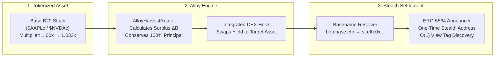
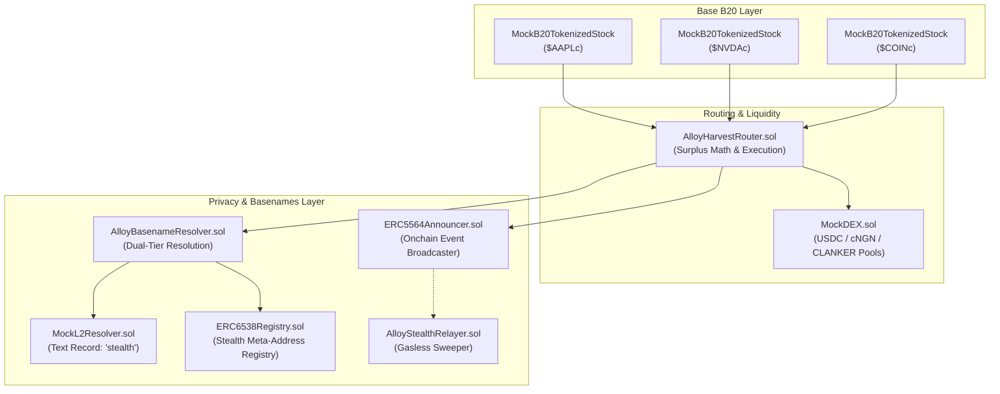
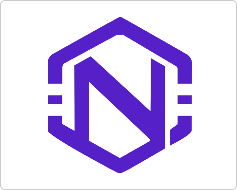

<div align="center">

  

  # Alloy
  ### Private Programmable Dividend Rails for Tokenized Equities on Base

  <p align="center">
    <strong>Extract tokenized stock dividends into any currency without touching equity principal or exposing your wallet onchain.</strong>
  </p>

  <p align="center">
    <a href="https://sepolia.basescan.org"></a>
    <a href="https://eips.ethereum.org/EIPS/eip-5564"></a>
    <a href="https://docs.base.org/base-names"></a>
    <a href="https://github.com/foundry-rs/foundry"></a>
    <a href="#license"></a>
  </p>

  <p align="center">
    <a href="#-quick-links">Quick Links</a> •
    <a href="#-the-problem">The Problem</a> •
    <a href="#-how-it-works">How It Works</a> •
    <a href="#-system-architecture">Architecture</a> •
    <a href="#-mathematical-invariant">The Math</a> •
    <a href="#-deployed-contracts">Deployments</a> •
    <a href="#-local-development">Development</a>
  </p>

</div>

---

## ⚡ Quick Links

- **Live Application**: [https://alloy.nebulaz.xyz/](https://alloy.nebulaz.xyz/)
- **Demo Video**: [Demo video](https://www.loom.com/share/cb513a90c15d4c94acfaf24d3534ede8)
- **Interactive Pitch Deck**: [https://alloy.nebulaz.xyz/sdeck](https://alloy.nebulaz.xyz/deck)
- **Base Builder Quest Code**: `bc_yd1de2n7`
- **Target Network**: Base Sepolia (`Chain ID: 84532`)

---

## 🎯 What is Alloy?

**Alloy** is an open-source, non-custodial dividend harvesting rail purpose-built for **Base B20 tokenized stocks** (such as `$AAPLc`, `$NVDAc`, and `$COINc`).

Real-world stocks pay real-world corporate dividends. However, on public blockchains, accessing that yield is fundamentally broken: contract mechanisms lock dividends inside internal token multipliers, manual selling dilutes your stock position, and public transactions broadcast your net worth to the world.

Alloy solves this by:
1. **Conserving 100% of Equity Principal**: Trims only mathematical surplus yield ($\Delta B$) using formally verified formulas, leaving baseline stock shares completely untouched.
2. **Multi-Currency Payout Flexibility**: Instantly converts trimmed dividend yield into global stablecoins (**USDC**), emerging market currencies (**cNGN**), or ecosystem tokens (**CLANKER**).
3. **Unlinkable Stealth Privacy**: Routes all dividend payouts to one-time **ERC-5564 stealth addresses** resolved from native **Base Basenames** (`name.base.eth`), ensuring zero connection between your equity vault and your payout wallet.

---

## 💥 The Problem

```
┌───────────────────────────┐      ┌───────────────────────────┐      ┌───────────────────────────┐
│   01. MULTIPLIER TRAP     │      │  02. PRINCIPAL EROSION    │      │  03. PUBLIC SURVEILLANCE  │
│                           │      │                           │      │                           │
│ Dividends are locked      │      │ Liquidating shares to get │      │ Claiming dividends on     │
│ inside internal B20       │ ───> │ cash permanently reduces  │ ───> │ BaseScan publicly doxxes  │
│ multipliers to maintain   │      │ core equity ownership     │      │ your portfolio size and   │
│ DeFi collateral powers.   │      │ and triggers tax events.  │      │ recurring income stream.  │
└───────────────────────────┘      └───────────────────────────┘      └───────────────────────────┘
```

1. **The Multiplier Trap**: To stay compatible with Aave lending pools and Aerodrome AMMs, Base B20 tokenized stocks do not rebase holder balances or airdrop tokens. Instead, corporate actions trigger an increase in an internal contract `multiplier()` (e.g., $1.00\times \rightarrow 1.033\times$). The yield stays frozen inside the contract.
2. **Principal Erosion**: Under status quo, accessing cash requires manually calculating profits and selling shares on an open market. This shrinks your equity principal and incurs trading fees and tax friction.
3. **The Privacy Paradox**: Financial privacy is non-negotiable for serious equity holders. Collecting regular dividends directly to your primary wallet exposes your entire stock portfolio, net worth, and historical transactions to anyone tracking the ledger.

---

## 🚀 How It Works



Alloy executes this entire cycle in a single, non-custodial transaction:

1. **Checkpoint & Detect**: Alloy monitors the B20 equity contract. When an off-chain corporate dividend increases the multiplier ($M_{\text{current}} > M_{\text{checkpoint}}$), Alloy detects the exact surplus claimable.
2. **Invariant Share Trimming**: Alloy trims *only* the surplus fractional shares ($\Delta B$). The user's original principal value evaluated at the new multiplier remains identical to their checkpoint.
3. **DEX Swapping**: The trimmed surplus shares are sold through the liquidity pool into the user's selected payout currency (USDC, cNGN, or CLANKER).
4. **Stealth Basename Delivery**: Senders resolve the user's Basename to an ERC-5564 stealth meta-address, derive a one-time unlinkable stealth address on Base, and emit an announcement view tag.
5. **Private Scanning & Withdrawal**: The recipient opens their Alloy Stealth Inbox, checks incoming payouts in $O(1)$ time via 1-byte view tags, and sweeps funds using their ephemeral spending private key.

---

## 📐 The Mathematical Invariant

Alloy enforces an exact capital conservation invariant verified down to **1 wei precision** with Foundry fuzz tests.

### Surplus Share Extraction Formula
For a user with raw token balance $B$, checkpointed at multiplier $M_{\text{checkpoint}}$, and evaluated at current multiplier $M_{\text{current}}$:

$$\Delta B = B \times \frac{M_{\text{current}} - M_{\text{checkpoint}}}{M_{\text{current}}}$$

### The Capital Conservation Proof
The remaining raw balance $(B - \Delta B)$ evaluated at $M_{\text{current}}$ exactly preserves the holder's baseline principal claim:

$$(B - \Delta B) \times M_{\text{current}} \equiv B \times M_{\text{checkpoint}}$$

### Concrete Example
- **Initial State**: Holder deposits **100.0 AAPLc** at multiplier **$1.000\times$** ($200/share = **$20,000.00 principal**).
- **Dividend Event**: Apple pays a corporate dividend. Multiplier updates to **$1.033\times$** (Total equity claim = **$20,660.00**).
- **Alloy Harvest**:
  - Surplus trimmed: $\Delta B = 100 \times \frac{1.033 - 1.000}{1.033} \approx 3.1945\text{ shares} \rightarrow \mathbf{\$638.90\text{ USDC}}$.
  - Remaining shares: $96.8055\text{ shares} \times 1.033 = 100.0\text{ shares equivalent} \rightarrow \mathbf{\$20,000.00\text{ principal intact}}$.
- **Result**: Exactly 100% of the initial principal is conserved. Zero forced equity liquidation.

---

## 🏛️ System Architecture

Alloy is structured into three modular layers: **Asset Mechanics**, **Settlement Routing**, and **Identity & Privacy**.



### Dual-Tier Basename Resolution
1. **Tier 1 (ENS Text Record)**: Queries `MockL2Resolver.text(namehash, "stealth")` to retrieve the recipient's `st:eth:0x...` stealth meta-address.
2. **Tier 2 (ERC-6538 Fallback)**: Resolves the owner's canonical address via `MockL2Resolver.addr(namehash)` and queries `ERC6538Registry.stealthMetaAddressOf(address, 1)`.

### Cryptographic Stealth Protocol (secp256k1 ECDH)
- **Recipient Keys**: Spending key $K_{\text{spend}} = k_{\text{spend}} \cdot G$, Viewing key $K_{\text{view}} = k_{\text{view}} \cdot G$.
- **Sender Derivation**:
  1. Generate ephemeral secret $r \in \mathbb{F}_q$, ephemeral public key $R = r \cdot G$.
  2. Compute shared secret: $S = r \cdot K_{\text{view}}$.
  3. Derive stealth address: $P = K_{\text{spend}} + \text{keccak256}(S) \cdot G$.
  4. Compute 1-byte view tag: $v = \text{first\_byte}(\text{keccak256}(S))$.
- **Recipient Discovery**: $S' = k_{\text{view}} \cdot R$. If $\text{first\_byte}(\text{keccak256}(S')) == v$, compute $k_{\text{stealth}} = (k_{\text{spend}} + \text{keccak256}(S')) \pmod n$.

---

<!--- ## 📱 Application Preview

| Hero & WebGL Background | Interactive Surplus Harvest |
| :---: | :---: |
|  |  |
| *WebGL2 dithering ray background with high-contrast typography* | *1-click surplus extraction into USDC, cNGN, or CLANKER* |

| Stealth Inbox Scanner | Onchain Basename Resolution |
| :---: | :---: |
|  |  |
| *O(1) view tag announcement scanning with instant sweeping* | *1-click publish to Base Sepolia MockL2Resolver & ERC-6538* |

---
-->

## 📜 Deployed Contracts (Base Sepolia)

All contracts are deployed, active, and verified on **Base Sepolia (Chain ID: `84532`)**:

| Contract | Address | Description | Explorer |
| :--- | :--- | :--- | :--- |
| **`MockB20 AAPLc`** | [`0x5B57069627a99E79d852C3A156886E0Db9e703a8`](https://sepolia.basescan.org/address/0x5B57069627a99E79d852C3A156886E0Db9e703a8) | Tokenized Apple Stock (B20 standard with multiplier) | [BaseScan ↗](https://sepolia.basescan.org/address/0x5B57069627a99E79d852C3A156886E0Db9e703a8) |
| **`MockB20 NVDAc`** | [`0x6c42b4049dA39216d49Da72AA6B199D7aF877fF6`](https://sepolia.basescan.org/address/0x6c42b4049dA39216d49Da72AA6B199D7aF877fF6) | Tokenized Nvidia Stock (B20 standard with multiplier) | [BaseScan ↗](https://sepolia.basescan.org/address/0x6c42b4049dA39216d49Da72AA6B199D7aF877fF6) |
| **`MockB20 COINc`** | [`0xC766102E8140E46dfB12b01Ab79667df1D38C724`](https://sepolia.basescan.org/address/0xC766102E8140E46dfB12b01Ab79667df1D38C724) | Tokenized Coinbase Stock (B20 standard with multiplier) | [BaseScan ↗](https://sepolia.basescan.org/address/0xC766102E8140E46dfB12b01Ab79667df1D38C724) |
| **`Mock USDC`** | [`0xb15cbEc963EC9791dF96ca60e5b73E7202511747`](https://sepolia.basescan.org/address/0xb15cbEc963EC9791dF96ca60e5b73E7202511747) | USD Coin (6 decimals, EIP-2612 permit) | [BaseScan ↗](https://sepolia.basescan.org/address/0xb15cbEc963EC9791dF96ca60e5b73E7202511747) |
| **`Mock cNGN`** | [`0xe1D6e244632Cbb1d89cE2Da1e21Ec83FCCb63656`](https://sepolia.basescan.org/address/0xe1D6e244632Cbb1d89cE2Da1e21Ec83FCCb63656) | Compliant Nigerian Naira stablecoin (6 decimals) | [BaseScan ↗](https://sepolia.basescan.org/address/0xe1D6e244632Cbb1d89cE2Da1e21Ec83FCCb63656) |
| **`Mock $CLANKER`** | [`0xf73716899193ce90377631Aa00DCD9C6eDB19aF8`](https://sepolia.basescan.org/address/0xf73716899193ce90377631Aa00DCD9C6eDB19aF8) | Base AI Meme Token (18 decimals) | [BaseScan ↗](https://sepolia.basescan.org/address/0xf73716899193ce90377631Aa00DCD9C6eDB19aF8) |
| **`Mock DEX`** | [`0x15bCFD66af185c97CB99dfe0a2d2d3c027Da6DF1`](https://sepolia.basescan.org/address/0x15bCFD66af185c97CB99dfe0a2d2d3c027Da6DF1) | Secondary AMM & Swap Router | [BaseScan ↗](https://sepolia.basescan.org/address/0x15bCFD66af185c97CB99dfe0a2d2d3c027Da6DF1) |
| **`Alloy Harvest Router`** | [`0x22fd6f7283aF20815980228F563a17F21B25C359`](https://sepolia.basescan.org/address/0x22fd6f7283aF20815980228F563a17F21B25C359) | Master Dividend Extraction & Settlement Coordinator | [BaseScan ↗](https://sepolia.basescan.org/address/0x22fd6f7283aF20815980228F563a17F21B25C359) |
| **`Alloy Basename Resolver`** | [`0xD5687794c8E1b69F477911Df56170679CB6414eC`](https://sepolia.basescan.org/address/0xD5687794c8E1b69F477911Df56170679CB6414eC) | Dual-Tier Basename Resolution Contract | [BaseScan ↗](https://sepolia.basescan.org/address/0xD5687794c8E1b69F477911Df56170679CB6414eC) |
| **`ERC5564 Announcer`** | [`0xBd809F5Fef1dB656cc3b38386C31aA64D1a967F5`](https://sepolia.basescan.org/address/0xBd809F5Fef1dB656cc3b38386C31aA64D1a967F5) | Canonical ERC-5564 Stealth Event Broadcaster | [BaseScan ↗](https://sepolia.basescan.org/address/0xBd809F5Fef1dB656cc3b38386C31aA64D1a967F5) |
| **`ERC6538 Registry`** | [`0xf54e5c0A08CEf9263dd3c24dd1cbdFaaEe353F6B`](https://sepolia.basescan.org/address/0xf54e5c0A08CEf9263dd3c24dd1cbdFaaEe353F6B) | Canonical ERC-6538 Stealth Meta-Address Registry | [BaseScan ↗](https://sepolia.basescan.org/address/0xf54e5c0A08CEf9263dd3c24dd1cbdFaaEe353F6B) |
| **`Mock L2Resolver`** | [`0x1ab326aF806bE8Fb95F051A7347184242E3D1328`](https://sepolia.basescan.org/address/0x1ab326aF806bE8Fb95F051A7347184242E3D1328) | Base Basenames L2Resolver Simulator | [BaseScan ↗](https://sepolia.basescan.org/address/0x1ab326aF806bE8Fb95F051A7347184242E3D1328) |
| **`Alloy Stealth Relayer`** | [`0xc9d7d371bEc6aafeC73C202821A75b230Ad00D24`](https://sepolia.basescan.org/address/0xc9d7d371bEc6aafeC73C202821A75b230Ad00D24) | Gasless sweeper for zero-ETH stealth recipients | [BaseScan ↗](https://sepolia.basescan.org/address/0xc9d7d371bEc6aafeC73C202821A75b230Ad00D24) |

**Base Builder Code**: `bc_yd1de2n7`  
**Deployer Address**: `0xeca6Ff5Ce16bf15E38a4F28DE6da2397438f7918`  
**Deployment Block**: `46446262`

---

## 🛠️ Local Development

### Prerequisites
- [Node.js](https://nodejs.org/) `>= 18.18.0`
- [pnpm](https://pnpm.io/) `>= 9.0.0`
- [Foundry](https://book.getfoundry.sh/getting-started/installation) (`forge`, `cast`, `anvil`)

### 1. Smart Contracts (Foundry)

```bash
# Navigate to contracts directory
cd contracts

# Install Foundry dependencies
forge install

# Compile contracts
forge build

# Run unit and invariant tests
forge test -vvv
```

### 2. Frontend Web Application (Next.js)

```bash
# Navigate to web application directory
cd app

# Install dependencies
pnpm install

# Start local development server
pnpm dev
```

Open [http://localhost:3000](http://localhost:3000) to view the application in your browser.  
To view the pitch deck, navigate to [http://localhost:3000/deck](http://localhost:3000/deck).

### 3. Simulating Corporate Dividend Actions with `cast`

You can test corporate dividend distributions directly from your terminal:

```bash
export RPC=https://sepolia.base.org

# Check current AAPLc multiplier (starts at 1e18 = 1.0x)
cast call 0x5B57069627a99E79d852C3A156886E0Db9e703a8 "multiplier()(uint256)" --rpc-url $RPC

# Distribute a $2.50 dividend on $200 AAPLc (+1.25% multiplier bump)
cast send 0x5B57069627a99E79d852C3A156886E0Db9e703a8 \
  "distributeDividend(uint256,uint256)" \
  2500000000000000000 200000000000000000000 \
  --private-key <YOUR_PRIVATE_KEY> --rpc-url $RPC

# Resolve a Basename to its ERC-5564 stealth meta-address
cast call 0xD5687794c8E1b69F477911Df56170679CB6414eC \
  "resolveBasename(string)(bytes,address)" "bob.base.eth" \
  --rpc-url $RPC
```

---

## 🌍 Real-World Use Cases

- **Emerging Markets (e.g. Nigeria, LatAm)**: Investors can hold tokenized US blue chips and stream quarterly dividends directly into local stablecoins (such as **cNGN**) for immediate real-world commerce without manual forex conversions.
- **Family Offices & High-Net-Worth Individuals**: Eliminate public net-worth surveillance and targeted phishing vectors by having dividend cash flows delivered to untraceable stealth addresses.
- **DeFi Lending Collateral**: Tokenized stock tokens deposited into lending protocols (like Aave) maintain full collateral weight, while Alloy siphons off dividend yield without disturbing the borrowing health factor.
- **Autonomous Wealth Streams**: Configure automated triggers to sweep dividend surplus into high-yield stablecoins or Base ecosystem assets (like CLANKER).

---

## 🔒 Security & Privacy Guarantees

- **Non-Custodial Architecture**: User equity tokens are never locked in Alloy vaults; trimming occurs only at the exact moment of authorized harvest.
- **Mathematical Invariant Rigor**: The surplus formula preserves the product of remaining shares and the updated multiplier, guaranteeing zero equity dilution.
- **Cryptographic Unlinkability**: Derives one-time stealth addresses via secp256k1 elliptic-curve Diffie-Hellman (ECDH). Senders cannot trace past or future transactions to the same recipient.
- **Lightweight Discovery**: 1-byte view tags prevent client-side battery and bandwidth exhaustion by filtering announcements in $O(1)$ time.

---

## 📄 License

This project is licensed under the **MIT License** — see the [LICENSE](LICENSE) file for details.

---

<div align="center">
  <sub>Built with ❤️ on <strong>Base</strong> for the <strong>Base Builder Quest: Tokenized Stocks</strong>.</sub>
</div>
